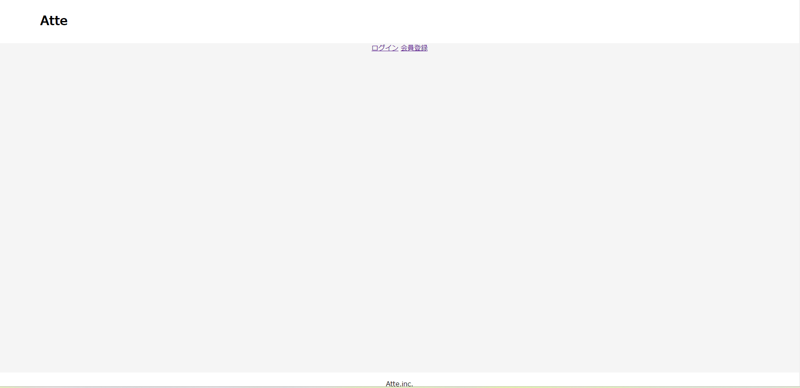
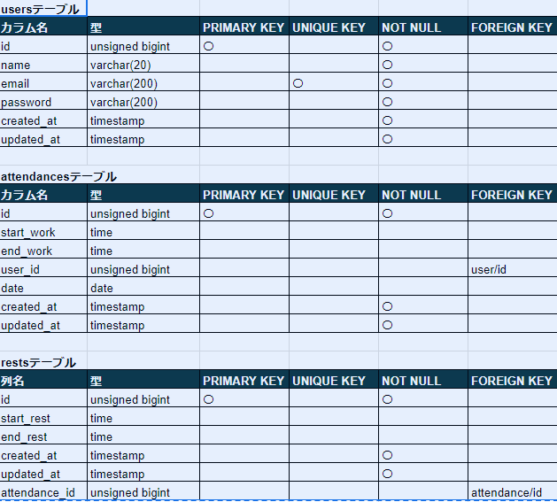
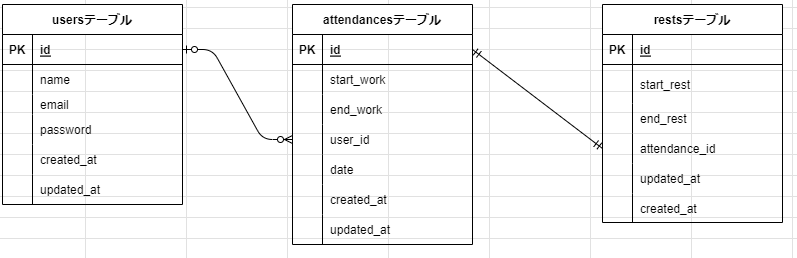

# 20230807_atte

##Atte

・概要説明
従業員の出退勤打刻・休憩打刻・勤務時間記録・休憩時間記録を管理するための勤怠管理システムです。
各従業員は各自のID・パスワード・メールアドレスを登録し、出勤の際は各自ログインを行って打刻操作を行います。
各従業員ごとに勤務時間・休憩時間を打刻し、記録するためのもので、
出退勤入力は１日に１度だけ、休憩の打刻は１日に何度でも可能です。
休憩時間は当日の休憩時間の合計を自動計算し管理できます。
１日の区切りは２４：００とし、０：００から２３：５９まで当日の勤務情報として
記録できます。
日付ごとの勤務情報をリスト表示し閲覧可能となっています。

##作成目的

勤務時間を元に人事評価を行う為。
タイムカードでの打刻ではなくシステム上で管理を行う為、各自のタイムカードを一つずつ確認する必要がなくなります。
そうすることで、人事評価に伴う業務効率化を図っています。

##アプリケーションURL

http://localhost/

ログイン及び会員登録画面。
勤務開始の際はこのURLから画面表示し画面に沿って操作を行ってください。

##他のリポジトリ

他にリポジトリはありません。

##機能一覧

会員登録	Laravelの認証機能を利用
ログイン
ログアウト

勤務開始	日を跨いだ時点で翌日の出勤操作に切り替える
勤務終了

休憩開始	1日で何度も休憩が可能
休憩終了

日付別勤怠情報取得

ページネーション	5件ずつ取得

##使用技術

フレームワーク・laravel　ver8
使用言語・php
データベース・MySQL

##テーブル設計

##ER図

##環境構築

GitHub
https://github.com/fujino-papy/20230807_atte.git

##その他

ブラウザテスト
Google chrome・Microsoft Edge・firefox

上記３つのブラウザで正常動作を確認しております。# 20230906_atte
# 20230906_atte
